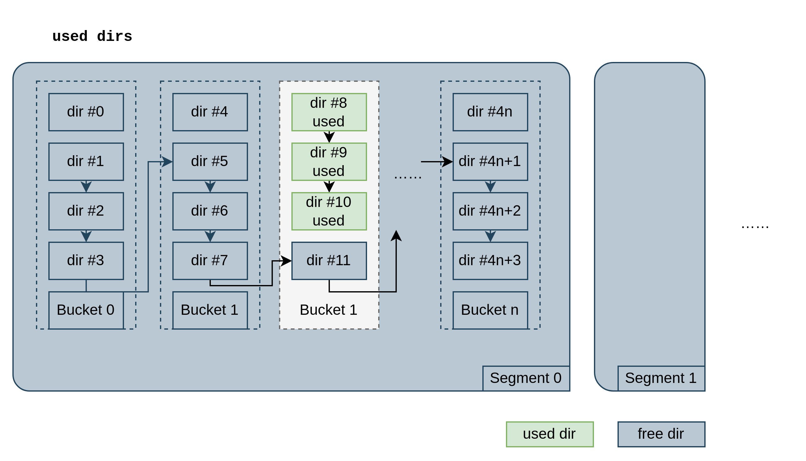

# bakemono

[](https://pkg.go.dev/github.com/bocchi-the-cache/bakemono)
[](https://goreportcard.com/report/github.com/bocchi-the-cache/bakemono) 
[](https://github.com/gojp/goreportcard/blob/master/LICENSE)
[](https://github.com/bocchi-the-cache/bakemono/actions/workflows/ci-bakemono-tests.yml)
[](https://codecov.io/gh/bocchi-the-cache/bakemono)

`bakemono`is a cache storage engine implemented in Go. 

<p align="center">
    <a href="https://github.com/bocchi-the-cache/bakemono" target="_blank"></a></p>

## 🏁 Design goals
- **🪶 Lightweight**: easy to embed in your project
- **🚀 High-performance**: high throughput and low latency
- **😀 Code-readable**: simple but powerful storage design, easy to read and understand

It is highly inspired by [Apache Traffic Server], implemented for our cache-proxy project [hitori].

## 💾 Cache Storage Engine
What is a **cache storage engine**? 
What is the difference from an **embeddable k-v database**?

**Similarities**:
They both are:
- key-value storage
- embeddable
- persistent storage on SSD/HDD

**Differences**:
Cache storage are:
- allowed to drop data when conditions are met
- fault-tolerant (just return a `MISS` when disk failure happens)

Cache storage is common in CDN (Content Delivery Network). It is used to cache frequently accessed data to reduce the load of backend servers.

The size of cache data is usually `~100TiB` per bare-metal server.

## 🗝️ Usage

### Install
You can use `bakemono` as a pkg in your project. 
```bash
go get github.com/bocchi-the-cache/bakemono
```

### Init
Then simply import and init a `Vol` in your code:
```go
func main() {
	cfg, err := bakemono.NewDefaultVolOptions("/tmp/bakemono-test.vol", 1024*512*100000, 1024*1024)
	if err != nil {
		panic(err)
	}
	
	v := &bakemono.Vol{}
	corrupted, err := v.Init(cfg)
	if err != nil {
		panic(err)
	}
	if corrupted {
		log.Printf("vol is corrupted, but fixed. ignore this if first time running.")
	}
	
	// ...
}
```

### Read/Write
```go
func main() {
    // ...
    
    // write
    err = v.Set([]byte("key"), []byte("value"))
    if err != nil {
        panic(err)
    }
    // read
	hit, data, err := v.Get([]byte("key"))
    if err != nil {
		// note: err can be not nil when disk failure happens
		// consider it as a MISS when err != nil, or log it to do further processing
        panic(err)
    }
    if !hit {
        panic("key should be hit")
    }
    if string(data) != "value" {
        panic("value should be 'value'")
    }
    log.Printf("value: %s", data)
	
	// close
    err = v.Close()
    if err != nil {
        panic(err)
    }
}
```

### Note

**Concurrency RW is supported**.

In this version, they are sharing several RWLocks. We will give more tuning options in the future.

**We highly recommend you to read tech design doc before using it in high-load scenarios.**


## 🤖 Tech Design
... until now. 

### Data Structure

There are 3 data structures in `bakemono`:

- **`Vol`**
  - **volume**, represents a single file on disk.
  - A `Vol` is what we finally persist on disk.
  - We will support bare block device in the future.
- **`Chunk`**
  - basic unit of your k-v cache data.
  - restored on disk.
- **`Dir`**
  - **directory**, a meta index of `Chunk`.
  - All `Dir`s are loaded in memory. It is compact.

#### 🧱 Chunk
`Chunk` is the basic unit of cache data.

| name           | data type      | desc                  |
|----------------|----------------|-----------------------|
| Magic          | uint32         | fixed: 0x00114514     |
| Checksum       | uint32         | checksum of DataRaw   |
| Key            | [3000]byte     | fixed size key bytes  |
| DataLength     | uint32         |                       |
| HeaderSize     | uint32         | fixed: 4096.          |
| HeaderChecksum | uint32         | checksum of the above |
| DataRaw        | variable bytes | raw data              |

We force set chunk header size to 4KB this version, a sector size.

#### 🔖 Dir
`Dir` is the meta index of `Chunk`. 

Every `Chunk` has a `Dir` to represent it in memory.

`Dir` is always loaded in memory.
```go
type Dir struct {
	/*
	   unsigned int offset : 24;  // (0,1:0-7)
	   unsigned int bigInternal : 2;      // (1:8-9)
	   unsigned int sizeInternal : 6;     // (1:10-15)
	   unsigned int tag : 12;     // (2:0-11)
	   unsigned int phase : 1;    // (2:12)
	   unsigned int head : 1;     // (2:13)
	   unsigned int pinned : 1;   // (2:14)
	   unsigned int token : 1;    // (2:15)
	   unsigned int next : 16;    // (3)
	   unsigned int offset_high : 16;

	   if unused, raw[2] is `prev`, represents previous dir in freelist.

	   approx_size = sectorSize(512) * (2**3big) * sizeInternal
	*/
	raw [5]uint16
}
```

`Dir` is organized in raw 10 bytes. Use bit operations to get/set fields. This is a design of [Apache Traffic Server].
We must save every bit to reduce memory usage.

Note: 
- If Dir is unused, `raw[2]` is `prev`, represents previous dir in freelist. To save 1 byte.
- Size is not exact. It is `sectorSize(512) * (2**3big) * sizeInternal`. Max to represent ~16GB using only 8 bits.

Memory usage:

If we have `100TB` data with `1MB` chunk size, we only need `100TB/1MB*10B = 1GB` memory to index `Dir`s.


#### 🪣 Segment, Bucket, Freelist
`Segment` and `Bucket` are logical groups of `Dir`. 

`Segment` is a collection of `Bucket`s. `Bucket` is a collection of `dir`s.

They are logically organized as below:


- `bucket` is group of fixed size `4` dirs.

- `segment` has max size `2^16=65536` dirs.

- `Dirs` is a linked list. 

- All **non-bucket-head** dirs to freelist when initializing, named `freeDirs`.

- `map[segmentId]dirId` to index the first **free dir** of each segment.

Note, dirs is an array in memory.

Why `segments`? We could lock, flush meta per segment.

#### 🗂️ Vol
`Vol` is the volume on disk. It is the final data structure we persist on disk.


**Vol offset calculation**:

init options are
```go
type VolOptions struct {
	Fp        OffsetReaderWriterCloser
	FileSize  Offset
	ChunkAvgSize Offset

	FlushMetaInterval time.Duration
}
```
Max dirs size is nearly `FileSize/ChunkAvgSize` (There are alignment for bucket and segments). 

Meaning, we have max `FileSize/ChunkAvgSize` chunks in this volume.

**Vol Multi meta**

Meta A/B are designed to be flush alternately. To avoid data loss when power failure happens.

In this version, only use meta A. Will implement multi meta in the future.

### Write

We use `md5` to hash key:
- key -> segmentId
- key -> bucketId

Once `segmentId` and `bucketId` are known:
- try to use **bucket-head** dir.
- if bucket-head is used, try to use **non-bucket-head** dir in this bucket.
- if all dirs in this bucket are used, try to grab a free dir from `freeDirs`.

When no free dir in `freeDirs`:
- rebuild `freeDirs` in this segment.
- if still no free dir, purge 10% buckets randomly in this segment.

Once get free dir, unlink it from `freeDirs` and link it as tail of bucket. Write `chunk offset`, `key` and `other metadata` to dir.

One example:



Then, write data to disk.
- rw lock the `Segment`
- write data to data range of `Vol`

Note: no hard limit for data size. But should **avoid too large data**, hold write lock too long.

Chunk data is cyclic, we will overwrite old data when disk is full. The advantage is
- sequential write is faster
- no need to delete old data
- no need to compact data in background
- no write amplification


### Read

We use `md5` to hash key same as write
- key -> segmentId
- key -> bucketId

Once `segmentId` and `bucketId` are known:
- find `key` dir linked list.
- if not found, return `MISS`
- if found, read `Chunk` data from disk.
- Check again the `full key` in `Chunk`.

Due to the only `12 bit tag` in dir, we have to check `key` again in `Chunk`.
Collision is possible, but will be much less when file size is large(>100GB).

There are a little read amplification due to approx size of `Dir`. But it is acceptable.

### Metadata Persistence
Flush/restore `meta A` with `FlushMetaInterval`.

Will implement multi meta in the future.

## Performance

Still in progress. 

On our initial testing with HDD, it is nearly same to do `fio` test on hard disk.


## Other Information
### Roadmap
- We are working on basic caching functions in this stage.
- When caching functions are stable, we will concentrate on performance tuning.

### Name Origin
**Bakemono** is a Japanese word meaning "monster". In Chinese, it is called "贵物". 

We wish it could be a **lightweight** but **high-performance** cache storage engine like a "bakemono"!

### Logo
The logo is designed by [Yige](https://yige.baidu.com/).

### Who are `bocchi-the-cache`?
We are a group of engineers who are interested in storage, networking and Go programming language.

We are excited to build projects using new technologies and share our experience with others.

[Apache Traffic Server]: https://trafficserver.apache.org/
[hitori]: https://github.com/bocchi-the-cache/hitori
